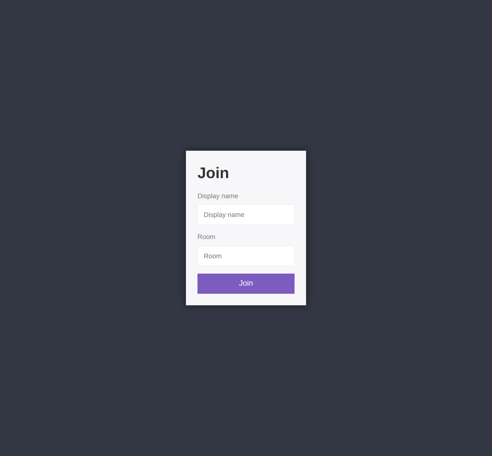
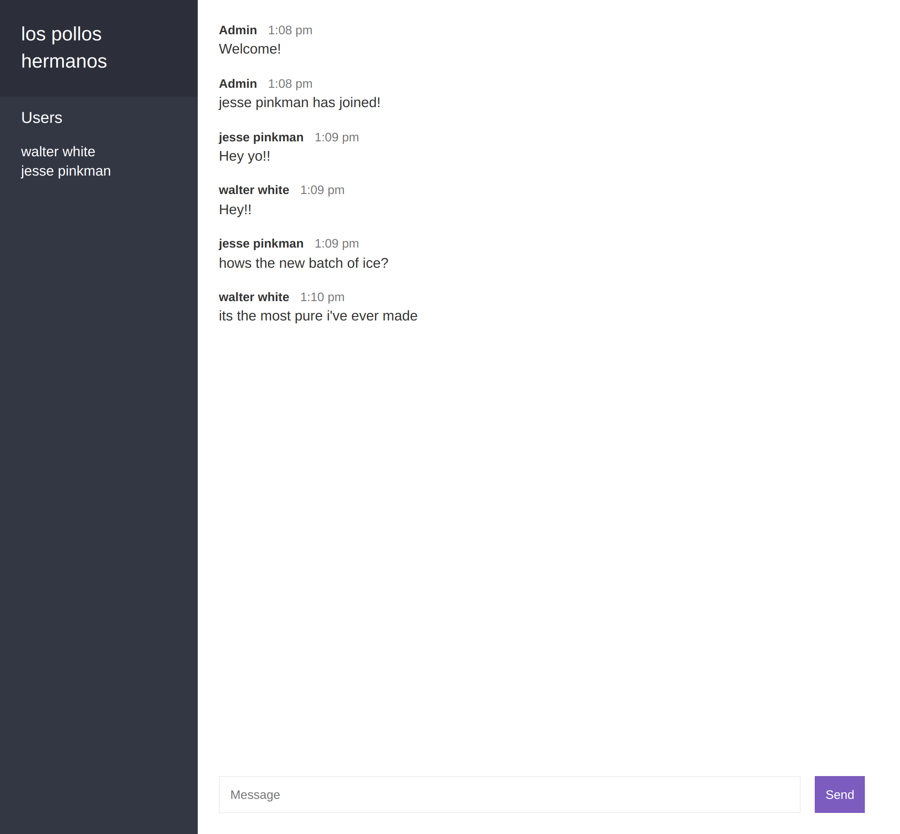

# Chat Application Using Node.js and Socket.io
This is a chat application made using Node.js and Socket.io for the real-time communication. Users can join a room and chat with other users in the same room.

## Features
* Join a room
* Send messages
* See who is online
* Chat with other users in the same room

## See the live demo
<a href="https://bz-chat-app.herokuapp.com/"> Click To View</a>

## Download & Setup Instructions

* 1 - Clone project:

      git clone https://github.com/bilal-zafarr/chat-app-node.git
        
* 2 - Go to project directory:

      cd ./chat-app-node

* 3 - Install dependencies: 
        
      npm install
        
* 4 - Run project: 

      npm start
        
* 5 - Open project in browser:

      http://localhost:3000

## Screenshot
#### Join Page

#### Home Page

